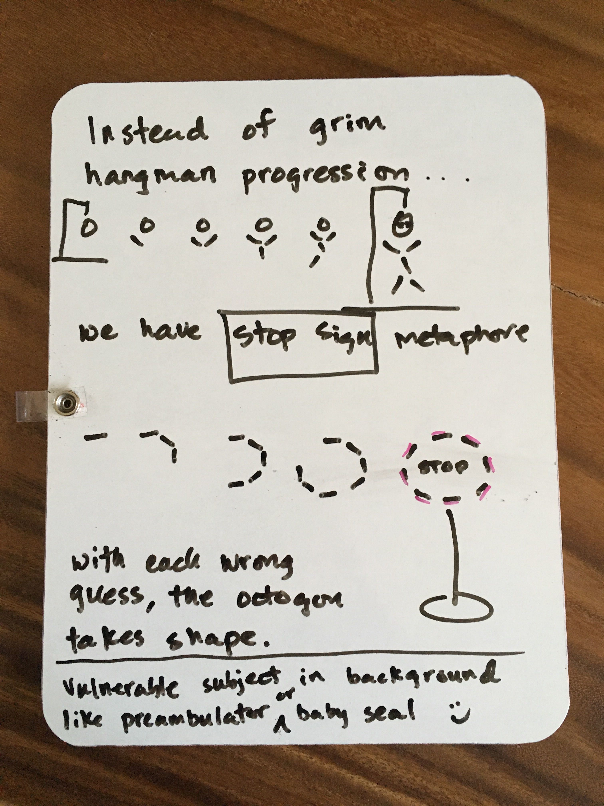
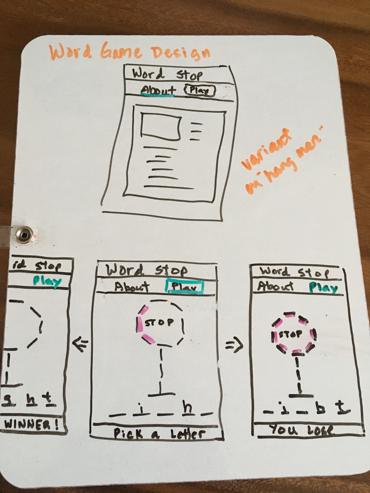
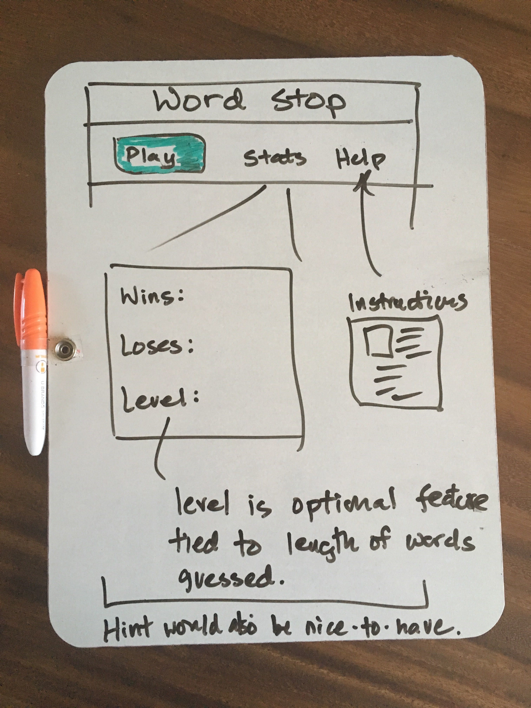
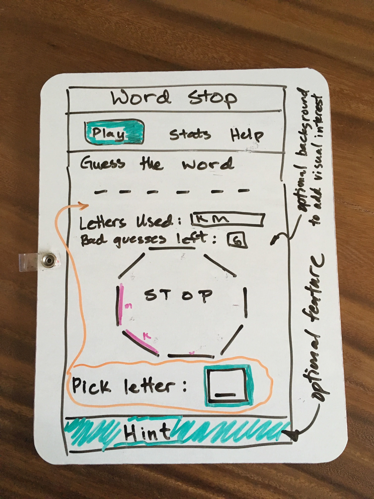
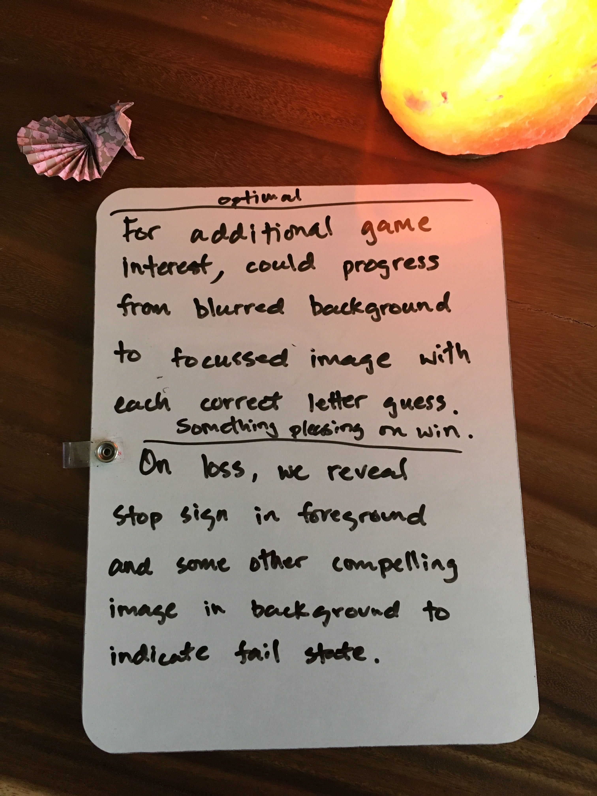
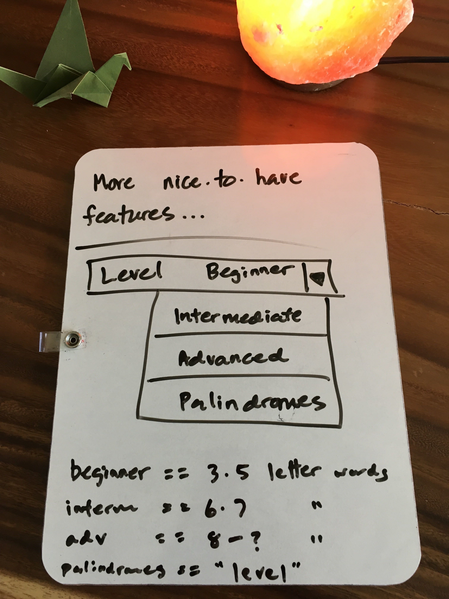
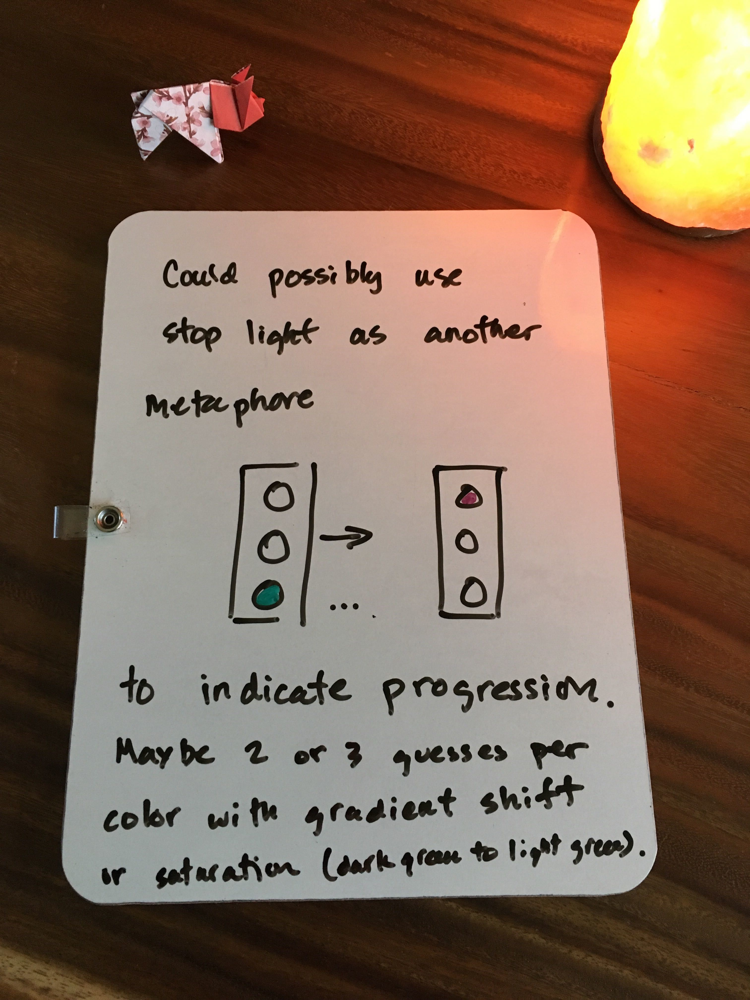
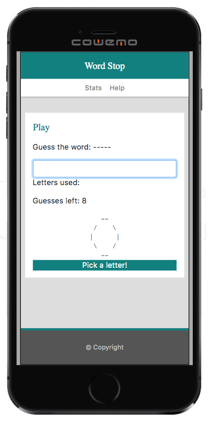
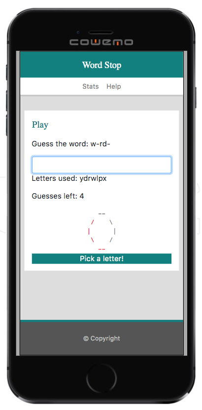

# utbc2019-hw-03-wordgame

## Designer's Log

There's a disturbance in the force, a problem to solve, a set of design constraints
to discern and address in some satisfying way.  My time is limited, though, so I need to 
scope the effort to available bandwidth and buy into the mantra, once again, that freedom is the creative
use of form.  But my nature is to conceptualize something aspirationally interesting, usually just 
beyond my ready grasp.  So there's a tension there.

The game of Hangman.  

Iconic and evocative.  Most of us in the culture of the west played it as kids.
You almost don't need to give much in the way of instruction, given it's baked in so deeply.

Still, it's all a bit grim.  And despite my healthy skepticism for the politically correct, I've
watched way too many episodes of the Hand Maid's Tale to buy into gallows-centered entertainment.

But what would be an interesting alternative that still meets the requirements?

Fortunately, there's sunshine this morning and a brisk walk to my favorite breakfast taco joint gives
me time to think.  A head, two arms, a torso, two legs.  That amounts to 6 wrong guesses before you lose
hangman, before the game is stopped.  The full body represents a stopping point.

What else represents a stopping point?  Something iconic that could be incrementally rendered
like hangman?  It would need to be compelling.  You gotta admit that the subtext of death in hangman does 
add motivation.  

I begin to think about lines and shapes.  What else can you make with 6 discrete segments?
Perhaps a stylized daisy with 6 'she loves me, she loves me not' petals that get plucked away
with each wrong guess?

I think of the word hex, as in a spell, a hexagram.  But a hexagram isn't really iconic, per se.

As I cross the street, I notice the stop sign.  True, it's an octogon, but it's a global icon for
stopping.  Just what I'm looking for.  Maybe I can incrementally render the outline of a stop sign
instead of a hangman.  It could be rendered with pole and base similar to hangman as well.  True, it
would amount to two extra guesses, but that's ok.  Just makes the game a tad easier.

But is a stop sign really /that/ compelling for game play?  Probably not by itself.  But if it
were placed in the right visual context, by adding a compelling background, maybe
it would.

And so my game of 'Word Stop' is conceived.

## Design Sketches

It occurs to me, I can reuse parts of my responsive portfolio design from the previous homework
to accelerate my progress.

With that in mind, here are the operational concepts that tumble out of my brain:

Optional design ideas:

## Here's what the MVP (minimal viable product) is looking like:

