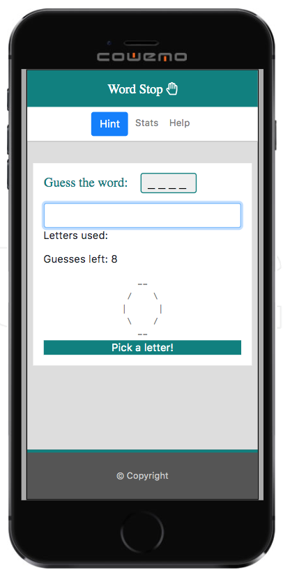
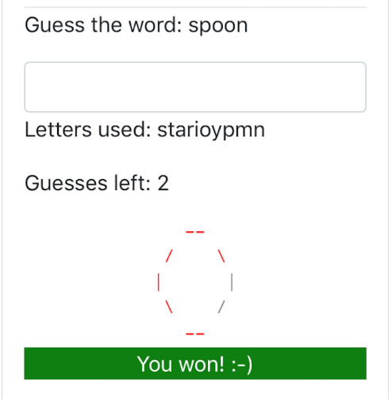
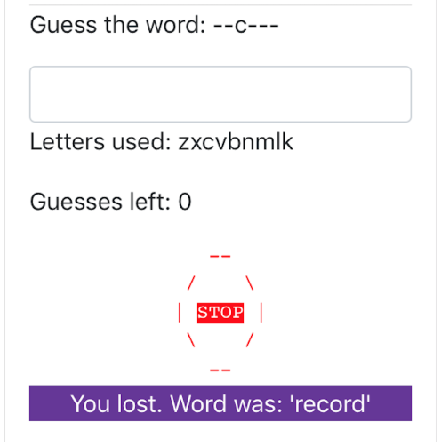

# utbc2019-hw-03-wordgame

This week I'm implementing my variation on the game of hangman.

## Release 1.2 

With this release, I've added selectable thematic lexicons:

In addition to the default basic English lexicon, I've added coffee and mythology related themes:

Thematic lexicons were implemented by subclassing the existing Lexicon object and adding an associated [background image](https://github.com/zenglenn42/utbc2019-hw-03-wordgame/blob/68010d8a3f1afb59da2a70c22e2774f9ebf4aa55/assets/js/lexicon.js#L896) for the related set of words.  The beauty of this approach is the app is thematically extensible merely by editing one [JSON object](https://github.com/zenglenn42/utbc2019-hw-03-wordgame/blob/fd95279cfee5851fd451ac49fdf28b45c6013ca2/assets/js/lexicon.js#L36).  The controller and view are data-driven by the model.

Just added a Chinese zodiac theme with beautiful [dragon picture](https://flic.kr/p/dQtgeq) from Luke Price ((CC BY 2.0).

I'm also adding several ui/ux usability tweaks after friends tested it on their phones.  

* I notice the pop-up keyboard takes up almost half the screen, totally occluding the stop-sign rendering.  So you don't get the visual cue of running out of guesses.  So I've opted to enlarge and bold the font for 'Guesses left'.  I've also floated it to the right and tucked it under the input form so it's more visible and mindful while entering letters.

* I give better visual cues in non-occluded areas when a round of play is over.

* On win or loss, I enhacing border width around the guessed word area.  

* On a loss, I fill in the missing letters and render the full word in red rather than report the word on an keyboard-occluded status area at the bottom of the main div.

## Release 1.1 

With this release, I've improved the styling with:

* background image
    * "Dictionary" courtesy of greeblie (Licensed under Creative Commons Attribution)
    * Source: [flickr](https://www.flickr.com/photos/greeblie/3338710223/in/photolist-662Len-82ot2J-9z5LDD-6GYYex-28NWojY-8mb6gc-6bUfZa-8LVo5P-aB6EXd-jQemaL-dqM1kk-5wkSxp-kgvfN-a5okUi-cywmx7-7Z9zYJ-3YG6-9Q74uJ-7vedzj-5EacGR-8X67Vx-86XVSo-bwinBK-8hAoHm-7Chssi-SWcBZ-4DANN8-2XKmhy-e3Unz-9mj5f6-fpwc98-8rR2E3-atnc38-5e5P7P-3YG7-58dUb-8KdRLe-7bJ2xs-8H831G-anApTw-4Ag3Xy-9T2ASa-8UuMmM-7Sbb8Q-GPF1H-3KSoEj-9VDo3r-gtua-5wQ2vV-21Wb7ac)
* more rounded corners
* better prompt readability

I've also tried to harden the code a bit by [abstracting the keyboard input event listener](https://github.com/zenglenn42/utbc2019-hw-03-wordgame/blob/68010d8a3f1afb59da2a70c22e2774f9ebf4aa55/assets/js/input-controller.js#L1) to quiesce events while state is being updated.  I was seeing some nuisance reset calls between rounds which this code addresses.

## Release 1.0 (MVP)

Here's what the final minimal viable product looks like:

The octogon lights up with red segments as the user (incorrectly) guesses letters for a word from a basic lexicon of 850 words.

Game play is pretty tame ...

Winning and losing look like this:

## Implementation Features

* [MVC](https://medium.freecodecamp.org/model-view-controller-mvc-explained-through-ordering-drinks-at-the-bar-efcba6255053) based (see [assets/js/model.js](https://github.com/zenglenn42/utbc2019-hw-03-wordgame/blob/master/assets/js/model.js) & [assets/js/controller.js](https://github.com/zenglenn42/utbc2019-hw-03-wordgame/blob/master/assets/js/controller.js))
* [Closures](https://github.com/zenglenn42/utbc2019-hw-03-wordgame/blob/f08e605b03e157e77a4cade64a6c7c530c6ea63d/assets/js/controller.js#L125) are used in the controller to return event handlers that set 'this' to my objects
* In the model, I use [inheritance](https://github.com/zenglenn42/utbc2019-hw-03-wordgame/blob/f08e605b03e157e77a4cade64a6c7c530c6ea63d/assets/js/model.js#L53) to subclass the WordStop game off a Game superclass.

In theory, it would be easy enough to subclass off the WordStop game to create something that only served up palindromes, for example.  Even the name of the game and [help text](https://github.com/zenglenn42/utbc2019-hw-03-wordgame/blob/ad02a309a5ff547a1d9a35de1a360b889b817f9b/assets/js/model.js#L60) are in the model.

* The implementation is responsive to different sized viewports.
* The [lexicon](https://github.com/zenglenn42/utbc2019-hw-03-wordgame/blob/cbd273864c0a01aa345b1f7fcdd9163810c17411/assets/js/lexicon.js#L1) was created by post-processing a basic list of English words from [here](https://simple.wikipedia.org/wiki/Wikipedia:Basic_English_ordered_wordlist).
* In the html, I used a dedicated <input> text control so on mobile devices, the keyboard would pop-up.

The two most interesting implementation blockers that really made me think were:

* [DOM rendering is not synchronous](https://github.com/zenglenn42/utbc2019-hw-03-wordgame/commit/181018e129ad4d3e46fe6bbcd95d3bb2f561005e)
* [Sharing js-runtime state across multiple html pages takes some thought :-)](https://github.com/zenglenn42/utbc2019-hw-03-wordgame/pull/8)

## Project Board

Checkout the [project board](https://github.com/zenglenn42/utbc2019-hw-03-wordgame/projects/1) to see how I decomposed this effort.

## Future Enhancements

* The design would benefit from some styling.  Replace the stop sign segments with a stop sign image outlined by a CSS polygon to mark progress.
* Themes could be added that affect the look and feel (backgrounds, fonts, colors, sounds) and include thematic lexicons.  The theme could be owned by the WordStop object and made selectable at runtime through a drop-down menu off the navbar.

## Designer's Log

This week I'm riff'ing on the game of Hangman.  

But what would be an interesting alternative to the classic game that would that still meets the requirements while being less grim?

There's sunshine this morning and a brisk walk to my favorite breakfast taco joint gives
me time to think.  You get 6 wrong guesses in hangman, with the complete figure representing a stopping point.

What else represents a stopping point?  Something iconic that could be incrementally rendered
like hangman? 

I begin to think about lines and shapes.  What else can you make with 6 discrete segments?
Perhaps a stylized daisy with 6 'she loves me, she loves me not' petals that get plucked away
with each wrong guess?

I think of the word 'hex', as in a spell, a hexagram.  But a hexagram isn't really iconic, per se.

As I cross the street, I notice the stop sign.  True, it's an octogon, but it's a global icon for
stopping.  Just what I'm looking for.  Maybe I can incrementally render the outline of a stop sign
instead of a hangman.  It could be rendered with pole and base similar to hangman as well.  True, it
would amount to two extra guesses, but that's ok.  Just makes the game a tad easier.

But is a stop sign really /that/ compelling for game play?  Probably not by itself.  But if it
were placed in the right visual context, by adding a compelling background, maybe
it would.

And so my game of 'Word Stop' is conceived.

## Design Sketches

It occurs to me, I can reuse parts of my responsive portfolio design from the previous homework
to accelerate my progress.

With that in mind, here are the operational concepts that tumble out of my brain:

Optional design ideas:

